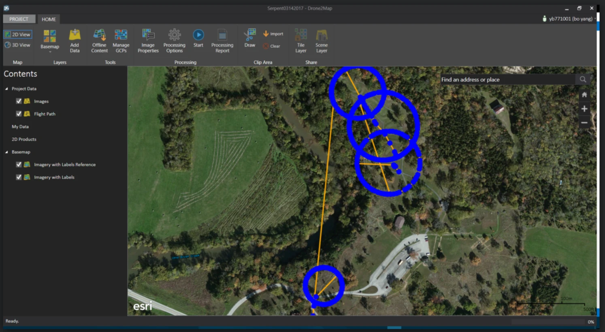
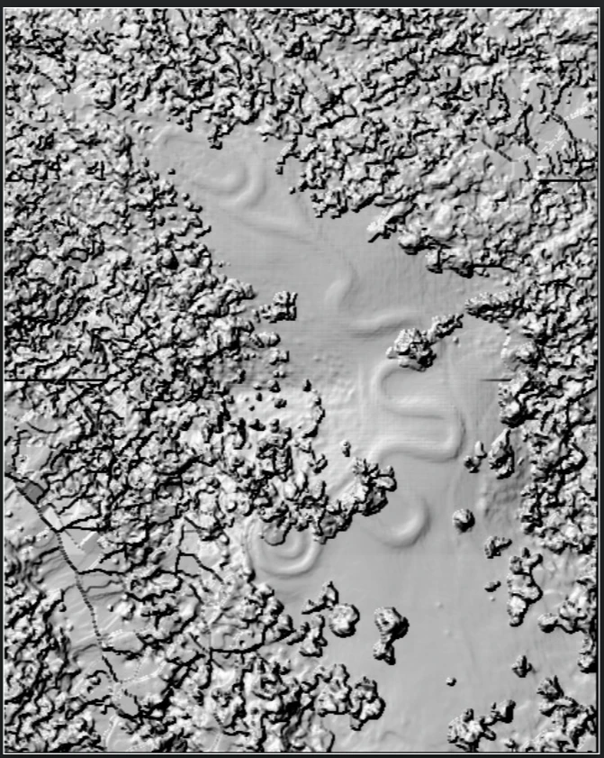
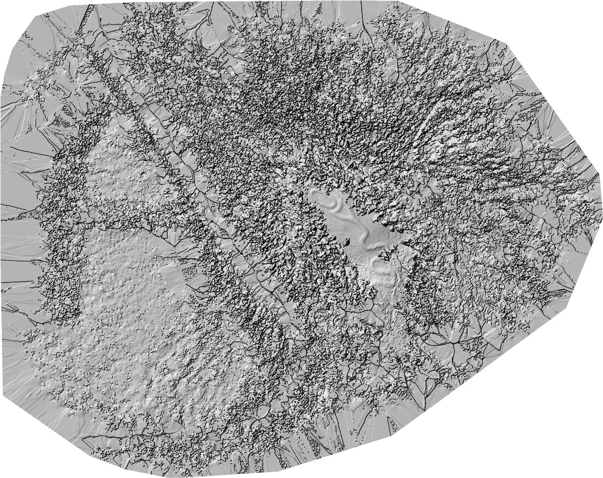

# Serpent Mound UAV Mapping — GeoFly Lab

Drone-based mapping products of the Great Serpent Mound, Adams County, Ohio, produced by the GeoFly Lab.

## Background

Serpent Mound is a quarter-mile-long prehistoric effigy mound overlooking Ohio Brush Creek in Adams County, Ohio. It is the largest known serpent effigy in the world, and its construction and age remain a subject of ongoing archaeological debate.

Early scientific excavation was carried out by Frederic Ward Putnam of Harvard in 1887–1889, who attributed the effigy to the Early Woodland **Adena** culture based on artifacts recovered from nearby conical burial mounds. Later work complicated this picture: radiocarbon dating in the 1990s (Lepper et al.) pointed instead to construction by the Late Prehistoric **Fort Ancient** culture, around AD 1070, since Fort Ancient art frequently depicts serpent imagery while Adena art does not. More recent radiocarbon work (Herrmann, Romain, et al.) has argued for an earlier Adena-era date, around 320 BC. A 2011 excavation led by Kevin Schwarz (ASC Group) recovered evidence of both occupations at the site — Adena activity dated to roughly 506–376 BC and Fort Ancient activity dated to roughly AD 1041–1211 — leaving the question of who built the serpent, and when, still unresolved.

Because the mound itself has yielded no datable material, attribution depends on indirect evidence from surrounding features. High-resolution spatial documentation of the earthwork's form, condition, and micro-topography supports this ongoing research, as well as long-term conservation monitoring of the site.

## UAV Mapping

The GeoFly Lab conducted a high-resolution UAV survey of Serpent Mound on **March 14, 2017**, flying at approximately **400 ft AGL** with a **DJI Phantom 4**. Standard photogrammetric processing was used to generate the following products:

- **Orthomosaic** — georeferenced, high-resolution aerial image of the site
- **Digital Surface Model (DSM)** — detailed surface elevation model capturing the mound's form and surrounding terrain

These products enable precise measurement of the effigy's dimensions, slope, and condition, and provide a baseline for monitoring change over time.

*Drone2Map processing preview: flight path and image overlap over the Serpent Mound site. The serpent effigy's outline is visible in the mowed grass at left.*

*Hillshaded Digital Surface Model (DSM) derived from the UAV survey. The serpent effigy's coiled, undulating form is clearly visible in the surface relief.*

*Wider-area hillshaded DSM covering the full UAV survey extent, showing the effigy in context with the surrounding bluff, drainages, and tree canopy.*

## Data

Mapping products (orthomosaic, DSM, and source imagery) are available here:

- **Download:** https://gofile.me/7U6Vx/qHzKoVl6U
- **Password:** `geofly`

## Credit

Produced by the GeoFly Lab.
